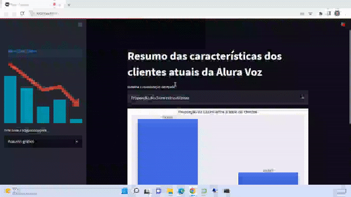

# Alura Challenge
A empresa operadora de telecomunicações Alura Voz necessita de um cientista de dados para avaliar e reduzir a Taxa de Evasão de Clientes, conhecido como Churn Rate.

A base de dados e suas informações foram adquiridas através da API da Alura Voz e estão disponíveis em https://github.com/sthemonica/alura-voz/blob/main/Dados/Telco-Customer-Churn.json

## Semana 01

Objetivos:

•	Entender quais informações o conjunto de dados possui;

•	Analisar quais os tipos de dados;

•	Verificar quais são as inconsistências nos dados;

•	Corrigir as inconsistências nos dados;

•	Traduzir as colunas;

•	Criar coluna de contas diárias.

## Semana 02

Objetivos:

•	Analisar a variável target: Churn;

•	Visualizar a distribuição da variável target: Churn;

•	Criar visualizações relevantes em relação ao Churn;

•	Analisar a correlação das variáveis;

•	Testar diferentes tipos de gráficos.

## Semana 03

Objetivos:

•	Verificar se a variável target está balanceada;

•	Aplicar encoding nos seus dados;

•	Criar dois ou mais modelos de Machine Learning;

•	Avaliar cada modelo utilizando métricas de ML;

•	Escolher o melhor modelo;

•	Otimizar o melhor modelo;

•	Verificar qual o melhor tipo de balanceamento com esses dados.

## Principais conclusões da Análise Exploratória:

 * Aproximadamente 22% dos clientes não assina o serviço de internet da Alura Voz. Campanhas comerciais de conversão dos clientes para este serviço podem ser interessantes;
 * 34% da base de clientes utiliza serviço de internet DSL. A depender da disponiblilidade da rede de Fibra Ótica, é interessante incentivar a alteração para este serviço, visto o ARPU (receita média por usuário) ser superior;
 * É grande o número de clientes que assina internet e não utiliza os serviços extras relacionados;
 * Grande quantidade de clientes possui um tempo curto de contrato, inferior a 1 ano. Observa-se, também, que existe uma relevante fatia dos clientes que possuem serviço com a Alura Voz há pelo menos 70 meses. É interessante, neste sentido, avaliar estratégias para fidelizar os clientes, de modo que os mesmos superem o primeiro ano de contrato e migrem para períodos de permanência superiores;
 * O gasto médio mensal por cliente se aproxima do gasto mediano. Quando tomamos como base o gasto total por cliente, temos um alongamento em direção ao terceiro quartil, indicando que uma parcela menor de usuários é responsável por um faturamento maior;
 * Há um gasto total maior por cliente relacionado aos serviços de internet fibra ótica e de clientes com contratos de prazo superior;
 * A taxa de Churn atual é cerca de 27%, bem acima da média das principais empresas nacionais de telecomunicação (3%);
 * Para aqueles clientes que saem da empresa, a mediana do tempo total de contrato (meses) é inferior àquela dos clientes que permanecem. Isto indica que a retenção dos clientes por um tempo superior pode levar à redução da taxa de Churn;
 * Enquanto os clientes com maior gasto total tendem a permanecer na Alura Voz, os maiores gastos mensais estão associados a clientes que deixaram a empresa;
 * Não há diferenciação relevante da taxa de churn entre os gêneros informados dos clientes;
 * Há uma relevante diminuição da taxa de Churn entre a base de clientes conforme se aumenta o período de contrato de serviços;
 * Há uma propensão menor de evasão da empresa dentre os clientes que optam pelo pagamento através de Cartão de Crédito, Boleto por correio ou Transferência Bancária, em detrimento aos que preferem Boleto Eletrônico.

## Principais conclusões da etapa de criação e avaliação do modelo de predição de Churn:

 * Uma vez que há um desbalanceamento dos dados na variável target 'Churn', devemos proceder com técnicas que consigam balancear os mesmos antes de utilizarmos nossos modelos. Duas técnicas consagradas podem ser utilizadas, quais sejam, undersampling (redução da quantidade de dados do valor 'Não') e oversampling' (ampliação dos dados do valor 'Sim');
 * É necessária, também, a normalização dos dados e a utilização da técnica de validação cruzada. Este procedimento é importante para evitarmos o chamado 'data leakage' e o conseguinte enviesamento dos modelos, e também a redução da aleatoriedade dos resultados;
 * Para a avaliação dos modelos de classificação, a métrica 'accuracy' não parece ser a melhor escolha na presença de dados desbalanceados. Outras métricas como a precisão, revocação e f1-score proporcionam um melhor julgamento dos resultados dos modelos;
 * Utilizando-se as duas técnicas de balanceamento e alguns modelos de machine learning de classificação, percebeu-se que o modelo Gradient Boosting Classifier, juntamente com a técnica oversampling, apresentou o melhor score integrado para o dataset;
 * Utilizando-se, ainda, o método 'GridSearchCV' para otimização dos hiperparâmetros do modelo selecionado, seguido de validação cruzada final, foi possível obter um f1-score de 0.78, em um intervalo estatístico de [0.75, 0.81] (95% de confiança).

## Deployment do modelo otimizado:

A fim de criar um resumo gráfico dos principais insights observados no projeto e disponibilizar o modelo para utilização externa, criou-se um aplicativo web através do framework Streamlit, disponível em: https://share.streamlit.io/fabianomanetti/alurachallenge/main/app.py

